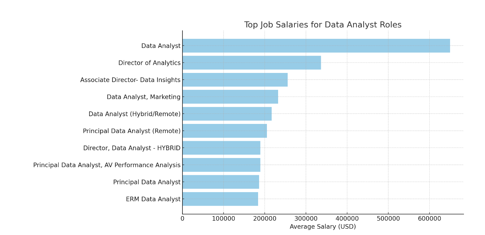
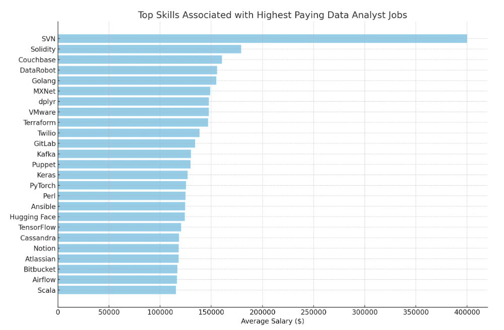
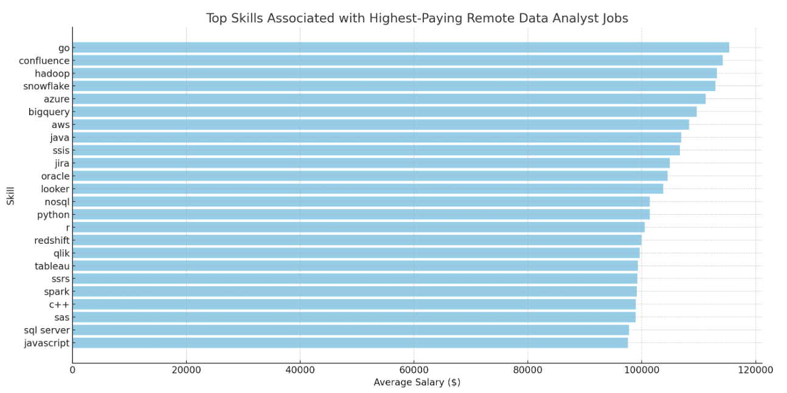
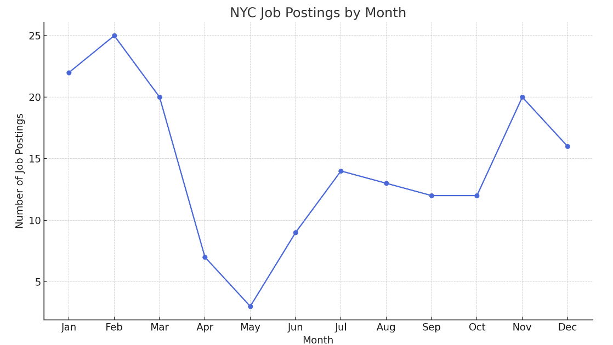
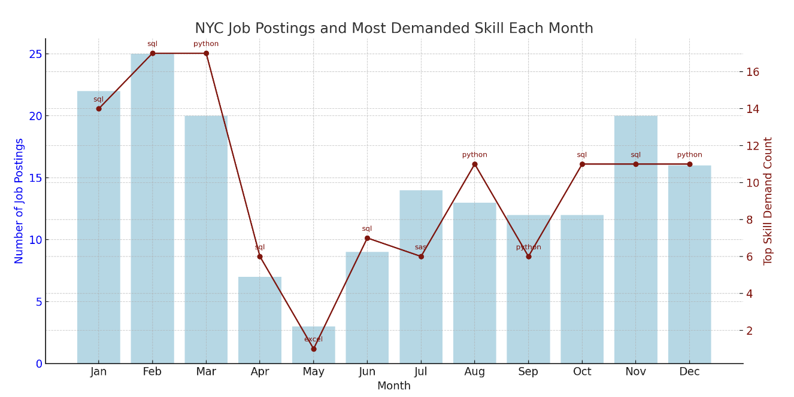

# Jobs Analysis
First project and introduction to Data Analysis utilizing SQL. The project focuses on utilizing SQL and its functionalities to explore details about the job market, including top-paying jobs and in-demand skills for data analytic roles. 

Check out the SQL queries utilized here: [project_jobs_sql folder](/project_sql/)

Please note that the first five queries were completed by following a tutorial to learn the basics of SQL and data exploration. The remaining queries were created independently to analyze and explore the job market on my own. Credits to: [project_tutorial](/https://www.youtube.com/watch?v=7mz73uXD9DA&t=12631s/)

## Background 
This project serves as my entry point for exploring data analytics and the languages/tools associated with it. As my first project, I decided to follow a tutorial and to explore the information regarding the job market. 

Data hails from [SQL Course](https://lukebarousse.com/sql). The data includes information regarding job titles and its associated roles, salaries and locations. 

### The questions that I wanted to answer:
 1. What are the top-paying data analyst jobs (anywhere)?
 2. What skills are employers looking for in their employees for these top-paying jobs?
 3. What skills are most in-demand for data analysts? 
 4. Which skills are associated with higher salaries (which skills should one focus on developing to land jobs)
 5. What are the optimal skills a person should spend the most time in developing
 6. What are the top-paying jobs in New York City specifically?
 7. What are the most in-demand skills that jobs are looking for in New York City?
 8. Which months had the most job-postings and which months had the least job-postings?
 9. What is the most demanded skill in each month? 

## Tools/Technologies Used
 - **SQL** 
 - **Postgres**

## The Analysis
### 1. Top Paying Data Analysis Jobs 

This query retrieves the top 10 highest-paying jobs related to Data Analyst in 2023. The results highlight which companies and roles offer the most competitive salaries for Data Analysts working remotely. This can give job seekers, with an interest in data analysis, an idea of what job titles they should be looking out for, should they want the highest paying salary. 

 ```
 SELECT
    job_id,
    job_title, 
    job_location, 
    job_schedule_type,
    salary_year_avg,
    job_posted_date,
    name AS company_name
FROM
    job_postings_fact
LEFT JOIN company_dim ON job_postings_fact.company_id = company_dim.company_id
WHERE
    job_title_short = 'Data Analyst' AND 
    job_work_from_home =  TRUE AND
    salary_year_avg IS NOT NULL
ORDER BY 
    salary_year_avg DESC
LIMIT 10
```

Here's the results of the top data analyst jobs in 2023:
 - The standard Data Analyst role has the highest average salary, exceeding other data analyst positions, at around $650,000.
 - Director-level roles, such as Director of Analytics, also have high salaries, though less than the top Data Analyst role, averaging around $330,000.




### 2. Top Paying Jobs and Associated Skills 

Captures high-paying Data Analyst and related roles, along with their average annual salaries, associated companies, and skills. The purpose is to identify which job titles, employers, and skill sets are most valued in the data analytics job market in 2023. This information can help job seekers understand which skills to develop and which roles or companies may offer the most competitive compensation.

```
WITH top_paying_jobs AS (
    SELECT
        job_id,
        job_title, 
        salary_year_avg,
        name AS company_name
    FROM
        job_postings_fact
    LEFT JOIN company_dim ON job_postings_fact.company_id = company_dim.company_id
    WHERE
        job_title_short = 'Data Analyst' AND 
        job_work_from_home =  TRUE AND
        salary_year_avg IS NOT NULL
    ORDER BY 
        salary_year_avg DESC
    LIMIT 10
)

SELECT 
    top_paying_jobs.*,
    skills
FROM top_paying_jobs
INNER JOIN skills_job_dim ON skills_job_dim.job_id = top_paying_jobs.job_id 
INNER JOIN skills_dim ON skills_job_dim.skill_id = skills_dim.skill_id
ORDER BY
    salary_year_avg DESC
```

Here's the results of the top skills for highest salary jobs in 2023:
 - It seems skills like sql, python, r, azure, databricks, aws, pandas, pyspark, jupyter, excel, tableau, power bi, and powerpoint are the skills required for top paying jobs
 - Most companies such as AT&T, Pinterest Job Advertisements and SmartAsset all desire these skills

### 3. Skill In Demand

This query identifies the top 5 most in-demand skills for Data Analyst roles that allow remote work. By counting how frequently each skill appears across relevant job postings, it highlights languages that are most sought after by employers. The purpose is to help job seekers prioritize which skills to develop to increase their competitiveness in the remote data analytics job market.

```
SELECT 
    skills,
    COUNT(skills_job_dim.job_id) AS demand_count
FROM job_postings_fact 
INNER JOIN skills_job_dim ON skills_job_dim.job_id = job_postings_fact.job_id 
INNER JOIN skills_dim ON skills_job_dim.skill_id = skills_dim.skill_id
WHERE
    job_title_short = 'Data Analyst' AND
    job_work_from_home = TRUE
GROUP BY 
    skills
ORDER BY 
    demand_count DESC
LIMIT 5 
```

Here's the results of the top skills in demand:
 - sql is the most in-demand language, as there is close to double of the jobs that require this skill than the second most frequent
 - The other languages are just as frequent and are skills that job seekers can think to develop

| Skill     |Demand Count |
|-----------|-------------|
| SQL       | 7291        |
| Excel     | 4611        |
| Python    | 4330        |
| Tableau   | 3745        |
| Power BI  | 2609        |

### 4. Skills Associated with Highest Paying Job

This query calculates the average annual salary for Data Analyst roles associated with each skill and identifies the top 25 skills linked to the highest-paying positions. By highlighting which skills correlate with higher salaries, the results help job seekers understand which competencies may lead to more lucrative opportunities in the data analytics field.

```
SELECT 
    skills,
    ROUND(AVG(salary_year_avg), 0) AS avg_salary
FROM job_postings_fact 
INNER JOIN skills_job_dim ON skills_job_dim.job_id = job_postings_fact.job_id 
INNER JOIN skills_dim ON skills_job_dim.skill_id = skills_dim.skill_id
WHERE
    job_title_short = 'Data Analyst' AND
    salary_year_avg IS NOT NULL
GROUP BY 
    skills
ORDER BY 
    avg_salary DESC
LIMIT 25 
```

Here are the results of the top skills associated with the highest-paying jobs:
- SVN is the skill linked to the highest average salary, significantly above the rest.
- Other skills like Solidity, Couchbase, and DataRobot also show strong earning potential, highlighting technologies that can help job seekers target more lucrative Data Analyst positions.



### 5. Skill Essential to Develop

This query identifies the skills most frequently listed in remote Data Analyst job postings that also report salary information. By joining the job postings with skill associations, it calculates both the number of jobs requiring each skill `demand_count` and the average annual salary for jobs linked to that skill `avg_salary`. This analysis provides insight into which skills are both common and high paying in remote Data Analyst roles, guiding job seekers toward what to develop.

```
SELECT
    skills_dim.skill_id,
    skills,
    COUNT(skills_job_dim.job_id) AS demand_count,
    ROUND(AVG(salary_year_avg), 0) AS avg_salary
FROM
    job_postings_fact
INNER JOIN skills_job_dim ON skills_job_dim.job_id = job_postings_fact.job_id 
INNER JOIN skills_dim ON skills_job_dim.skill_id = skills_dim.skill_id
WHERE
    job_title_short = 'Data Analyst' AND
    salary_year_avg IS NOT NULL AND
    job_work_from_home = TRUE
GROUP BY
    skills_dim.skill_id
HAVING  
    COUNT(skills_job_dim.job_id) > 10
ORDER BY 
    avg_salary DESC,
    demand_count DESC
LIMIT 25
```

Here are the results of the top skills associated with the highest-paying remote Data Analyst jobs:
- Go tops the list as the skill linked to the highest average salary, significantly above the others.
- Skills like Confluence, Hadoop, Snowflake, and Azure also show strong earning potential, indicating that expertise in these technologies can help job seekers target more lucrative positions.
- Popular analytics and programming skills such as Python, R, Tableau, and SQL Server appear frequently, demonstrating a balance between high demand and competitive salaries.



### 6. NYC Top Paying Job

This query highlights the highest-paying job postings located in New York specifically. The results are filtered to only include positions with reported salary data and are ordered from the highest to lowest salary. The query returns the top 20 job postings, providing insight into the most lucrative opportunities in the New York job market and helping job seekers identify employers and roles that offer the best compensation.

```
SELECT
    job_title, 
    ROUND(salary_year_avg, 0) AS salary_annual,
    job_posted_date,
    name AS company_name
FROM
    job_postings_fact
LEFT JOIN company_dim ON job_postings_fact.company_id = company_dim.company_id
WHERE
    job_location = 'New York' AND
    salary_year_avg IS NOT NULL
ORDER BY 
    salary_year_avg DESC
LIMIT 20
```

This query highlights the top 20 highest-salaried positions in New York. It pulls job titles, average annual salaries, posting dates, and hiring companies.
- Go tops the list as the skill linked to the highest average salary, significantly above the others.
- Skills like Confluence, Hadoop, Snowflake, and Azure also show strong earning potential, indicating that expertise in these technologies can help job seekers target more lucrative positions.


### 7. NYC Skill In Demand 

This query identifies the most in-demand skills for job postings located in New York with reported salary information. By joining job postings with their associated skills, it calculates the number of postings requiring each skill `demand_count`. The results are filtered to include only recent jobs posted after September 1, 2023. The query then returns the top 10 skills ordered by demand, offering valuable insight into the technical competencies most sought after by employers in the New York job market so job seekers know which skills to develop.

```
SELECT 
    skills,
    COUNT(skills_job_dim.job_id) AS demand_count
FROM job_postings_fact 
INNER JOIN skills_job_dim ON skills_job_dim.job_id = job_postings_fact.job_id 
INNER JOIN skills_dim ON skills_job_dim.skill_id = skills_dim.skill_id
WHERE
    job_location = 'New York' AND
    salary_year_avg IS NOT NULL AND 
    job_posted_date >= '2023-09-01'
GROUP BY 
    skills
ORDER BY 
    demand_count DESC
LIMIT 10
```

Here are the results of the most in-demand skills in New York (since September 2023):
- SQL leads as the top skill, appearing in the highest number of postings
- Widely used tools and languages like Excel, Python, and R also rank highly, reflecting their essential role in data analysis work
- Specialized skills such as Power BI, MySQL, NoSQL, Flow, and MATLAB appear less frequently but highlight additional technologies that may differentiate candidates in the job market


### 8. NYC Job Posting Each Month

This query tracks the amount of job postings in New York over time by grouping positions according to the month they were posted. Using the `EXTRACT(MONTH FROM job_posted_date)` function, it organizes postings by calendar month and counts the total number of jobs `num_jobs_posted` in each period. The results are sorted chronologically, providing a clear view of how hiring activity fluctuates month by month. This analysis helps reveal hiring patterns and can guide job seekers on when opportunities are most abundant in the New York job market.

```
SELECT 
    EXTRACT(MONTH FROM job_posted_date) AS month,
    COUNT(job_id) AS num_jobs_posted
FROM job_postings_fact
WHERE 
    job_location = 'New York'
GROUP BY 
    month
ORDER BY 
    month;
```

Here are the results of job postings by month in New York:
- Hiring activity peaked in February (25 postings) and January (22 postings), suggesting the start of the year may bring the most opportunities.
- The summer months of May (3 postings) and June (9 postings) showed the lowest activity, indicating a slowdown in hiring during this period.
- Posting levels recovered somewhat in the fall, with November (20 postings) and December (16 postings) marking another active period, showing companies may ramp up hiring before year-end.




### 9. NYC Most Demanded Skills Each Month

This query provides a month-by-month view of hiring activity in New York while also identifying the most in-demand skill for each month. It first calculates the total number of job postings per month `jobs_per_month` and then determines how often each skill appears within postings for that month `skills_per_month`. From there, it selects the top skill per month based on the highest demand `skill_demand_count`. Finally, the results combine overall job amount with the leading skill each month, giving both a sense of seasonal hiring trends and the shifting skill priorities of employers in the New York market. This gives job seekers an idea of what to develop for the best chances at landing jobs (or to simply have more options in the job market in 2023).

```
WITH jobs_per_month AS (
    SELECT 
        EXTRACT(MONTH FROM job_posted_date) AS month,
        COUNT(job_id) AS num_jobs_posted
    FROM job_postings_fact
    WHERE 
        job_location = 'New York'
    GROUP BY 
        month
    ORDER BY 
        month
), skills_per_month AS (
    SELECT
        EXTRACT(MONTH FROM job_posted_date) AS month,
        skills,
        COUNT(job_postings_fact.job_id) AS skill_demand_count
    FROM job_postings_fact
    INNER JOIN skills_job_dim ON job_postings_fact.job_id = skills_job_dim.job_id
    INNER JOIN skills_dim ON skills_dim.skill_id = skills_job_dim.skill_id
    WHERE 
        job_location = 'New York' 
    GROUP BY month, skills_dim.skills
), top_skill_per_month AS (
    SELECT DISTINCT ON (month)
        month, 
        skills,
        skill_demand_count
    FROM skills_per_month
    ORDER BY
        month, skill_demand_count DESC
)

SELECT 
    jobs_per_month.month,
    num_jobs_posted,
    top_skill_per_month.skills AS top_skill,
    skill_demand_count
FROM jobs_per_month
LEFT JOIN top_skill_per_month ON jobs_per_month.month = top_skill_per_month.month
ORDER BY
    top_skill_per_month.month
```

Here are the key insights from the results:
- SQL dominates throughout the year, ranking as the top skill in six months, particularly strong in the early months (January, February) and fall (October, November).
- Python emerges as a close competitor, leading in March, August, September, and December, showing its consistent demand across both mid-year and year-end.
- Other tools also appear seasonally: Excel in May (albeit with low postings) and SAS in July, suggesting occasional niche demand
- Hiring activity is highest in February (25 postings, SQL-heavy) and lowest in May (3 postings, Excel), showing clear seasonal fluctuations in both job availability and skill demand.




### Learnings

The New York City job market in 2023 reveals a skill-driven desire, where both timing and technical expertise play a crucial role in job-seeking success. Hiring activity fluctuates seasonally, with early months like January and February, offering the greatest number of opportunities, while the summer months show a noticeable decrease. Across the year, SQL and Python consistently dominate employer demand, emphasizing their importance as foundational skills for data analysts. Meanwhile, tools like Excel, SAS, and Power BI appear intermittently, showing that familiarity with diverse analytical platforms can provide a competitive edge. Altogether, mastering these in-demand skills and understanding when the market is most active can help job seekers strategically position themselves for success in New York’s competitive data job environment.

### Analysis Results
1. SQL and Python Lead Skill Demand:
     SQL remains the most frequently requested skill across multiple months, with Python emerging as a strong counterpart. Both are essential for data analysis and engineering roles in NYC.
2. Seasonal Hiring Peaks Early in the Year:
     Job postings are highest in January and February, suggesting that companies initiate most of their hiring early in the year. This is an optimal period for job seekers to apply and engage with employers.
3. Niche Skills Show Periodic Demand:
     While SQL and Python dominate, specialized tools like SAS (July) and Excel (May) appear briefly as top skills, indicating that certain roles or industries may possibly have distinct, time-bound hiring trends for specific technologies. (I would need to explore more data from different years for the job market to make a more accurate conclusion)
